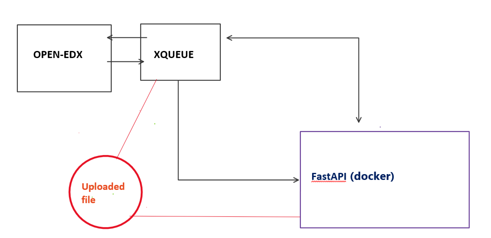

# xqueue_fastapi (external grader for Xqueue)

Application ตัวนี้จะทำตัวเป็น external grader ให้กับ openedx (ดูรายละเอียดได้ที่ [External Grader](https://edx.readthedocs.io/projects/edx-partner-course-staff/en/latest/exercises_tools/external_graders.html))
## Requirements
โดยที่สิ่งที่จำเป็นก่อนที่จะใช้ application ตัวนี้คือ
* Install Tutor version 12.0.4
* install Open edX version Lilac โดยใช้ Tutor
* Install plug-in ของ Tutor ที่มีชื่อว่า [tutor-xqueue](https://github.com/overhangio/tutor-xqueue)

หลังจากนั้นจะเห็นได้ว่าจะมี docker ที่ชื่อ xqueue ซึ่งจะเป็นตัวที่เชื่อมตัวระหว่าง Open edX กับ external grader 

## Installation
เบื่องต้นนั้นเราจะเชื่อมต่อ application ตัวนี้่ (ขอใช้เป็นชื่อ FastAPI) กับตัว xqueue โดยเราจะไปแก้ code ใน xqueue ให้ส่ง request ไป trigger ตัว FastAPI (หลังจากที่ user ทำการ submit ไฟล์หรือโค้ดที่ Open edX) เพื่อให้ตัว FastAPI ไปดึงข้อมูลเหล่านั้นจาก xqueue มาประมวลผลแล้วส่งกลับไป (ตามรูปภาพด้านล่าง)



โดยการใช้งาน FastAPI ตัวนี้จะ require 4 ขั้นตอนหลักๆดังนี้

### 1. Build custom xqueue image

สำหรับตัว custom xqueue นั้นก็คือ xqueue ที่ถูกเพิ่ม code ให้ส่ง trigger ไปยัง FastAPI โดย xqueue ที่ถูกดัดแปลงนั้นอยู่ที่ [titlethanason/xqueue](https://github.com/titlethanason/xqueue)


โดยสิ่งที่ต้องทำหลักๆสำหรับขั้นตอนนี้ก็คือให้ build image ในโฟล์เดอร์ ./docker_xqueue โดยให้ไปแก้ไฟล์ ./docker_xqueue/setting.py ในส่วนของตัวแปรที่ชื่อว่า FASTAPI_ENDPOINT (อยู่ที่ท้ายสุดของไฟล์) ให้ชี้ไปยังตัว FastAPI ที่เราจะทำการ build (http://{HOST}:{PORT}/submit) ก่อนที่จะ build image

```python
FASTAPI_ENDPOINT = "http://10.35.30.146:5000/submit" # http://{HOST}:{PORT}/submit
```
### 2. Build FastAPI
ก่อนที่จะ build image ของ FastAPI นั้นสิ่งที่จะต้องแก้ไขก็คือตัวแปรในไฟล์ ./settings.py นั่นก็คือตัวแปรของ tutor_config ซึ่งค่าที่จะนำมาใส่นั้นให้ไปดูใน config ของ tutor ซึ่งจะอยู่ที่ $(tutor config printroot)/config.yml หรือ $(tutor config printroot)/env/plugins/xqueue/apps/settings/tutor.py

```python
tutor_config = {
    "XQUEUE_AUTH_USERNAME": "lms",
    "XQUEUE_AUTH_PASSWORD": "mVlLdT1h", # XQUEUE_AUTH_PASSWORD ใน config.yml
    "ACTIVATE_HTTPS": False, # ENABLE_HTTPS ใน config.yml
    "XQUEUE_HOST": "xqueue.learn-ai.t.innosoft.kmutt.ac.th" # xqueue.{LMS_HOST}
}
```

### 3. Edit docker-compose
ให้เข้าไปแก้ไขไฟล์ docker-compose สำหรับการ run container ได้ที่ $(tutor config printroot)/env/local/docker-compose.yml
โดยเข้าไปแก้ image ในส่วนของ xqueue และ xqueue_consumer
```yml
  xqueue:
    image: 6893916e4d67 # ใส่ image ที่ได้จากขั้นตอนที่1 ตรงนี้
    volumes:
      - ../plugins/xqueue/apps/settings/tutor.py:/openedx/xqueue/xqueue/tutor.py:ro
      - ../../data/xqueue/media:/openedx/data/media
    environment:
      DJANGO_SETTINGS_MODULE: xqueue.tutor
    restart: unless-stopped
    depends_on: ["mysql"]

  xqueue-consumer:
    image: 6893916e4d67 # ใส่ image ที่ได้จากขั้นตอนที่1 ตรงนี้
    volumes:
      - ../plugins/xqueue/apps/settings/tutor.py:/openedx/xqueue/xqueue/tutor.py:ro
    environment:
      DJANGO_SETTINGS_MODULE: xqueue.tutor
    restart: unless-stopped
    entrypoint: ["sh", "-e", "-c"]
    command: ["while true; do echo 'running consumers'; ./manage.py run_consumer; sleep 10; done"]
    depends_on: ["mysql"]
```
และเพิ่มในส่วนของ FastAPI 
```yml
  xqueue-fastapi:
    image: 058b6178fb1d # ใส่ image ที่ได้จากขั้นตอนที่2 ตรงนี้
    volumes:
      - ../../data/xqueue/media:/xqueue_fastapi/data #ตรงนี้จะเป็นการ bind โฟล์เดอร์เก็บไฟล์ซึ่งจะไปตรงกับ settings.py ในขั้นตอนที่2
    restart: unless-stopped
    depends_on: ["mysql"]
    ports:
      - "5000:80" # PORT จะต้องตรงกับขั้นตอนที่1
```
**Note: $(tutor config printroot)/data/xqueue/media จะเป็น location default สำหรับไฟล์ที่ถูกอัพโหลดผ่านทาง xqueue
### 4. การสร้าง Problem ใน Open edX
ตัว application ตัวนี้มีการใช้ตัว library ของ [nbgrader](https://nbgrader.readthedocs.io/) สำหรับการตรวจข้อสอบที่เป็น jupyter notebook ฉะนั้นสำหรับการ submit ไฟล์ที่เป็น jupyter notebook (.ipynb) จะต้องส่งค่าบางอย่างมาบอกกับตัว application ด้วยว่าไฟล์ที่ส่งมานั้นเป็นไฟล์ที่ต้องการใช้ nbgrader ในการตรวจ (เบื้องต้นตอนนี้จะรองรับไฟล์เดียวเท่านั้นคือ [test001_1.ipynb](https://github.com/titlethanason/xqueue_fastapi/blob/master/nbgrader_workspace/release/test001/test001_1.ipynb))


สำหรับการเทสเบื้องต้นว่าตัว xqueue ได้เชื่อมต่อกับ FastAPI และทำงานได้ตามต้องการให้ทำการสร้าง Problem เหมือนตัวอย่างใน [tutor-xqueue](https://github.com/overhangio/tutor-xqueue) แต่ให้เปลี่ยน code เป็นดังนี้
```html
<problem>
    <coderesponse queuename="openedx">
    <label>
     อัพโหลดไฟล์ .ipynb 
    </label>
    <filesubmission/>
    <codeparam>
    <grader_payload>{"problem_number": 3, "assignment_id": "test001", "problem_id": "test001_1"}</grader_payload>
    </codeparam>
  </coderesponse>
</problem>
```
โดยข้อมูลใน <grader_payload> จะไป map กับเงื่อนไขใน application

